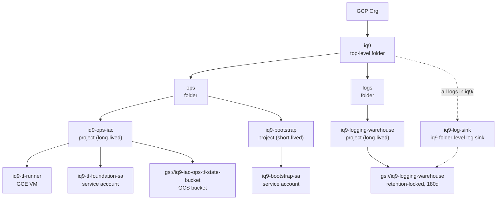
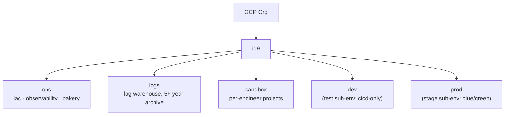

# Bootstrap

Manual `gcloud` scaffolding that prepares a GCP Org to host Terraform-managed infrastructure. Once this runs, every subsequent change to the GCP environment is an atomic, peer-reviewed Terraform apply driven from the `iq9-ops-iac` project.

> **Run this once, manually, from GCP Cloud Shell.** After the foundation layer is up, the bootstrap is never run again on the same org.

---

## Two run modes

**Greenfield** — brand new GCP Org with nothing in it yet. Run the playbook end-to-end.

**Clean-room on an existing org** — the org already has resources, but you want to stand up the `iq9/` hierarchy alongside them. Existing projects and folders stay where they are; you import them into Terraform later as time allows. This is the path the SimplifyMyCloud showcase uses to bring a new GCP Production online while leaving the existing GCP Dev untouched.

The playbook calls out which steps differ between the two paths.

---

## Environment model

There are **three** application environments and **two** infrastructure-supporting environments. The bootstrap creates the top-level `iq9` folder and the `ops` folder; the foundation layer creates the rest.

| Environment | Purpose |
| --- | --- |
| `sandbox` | Per-engineer playgrounds for testing GCP features, earning certifications, kicking the tires. **No company code or data allowed.** |
| `dev` | Where code is born — application layer, service layer (GCP services), infrastructure-as-code. Contains a **test** sub-environment where code blocks integrate for the first time, accessible to CI/CD only — no humans. |
| `prod` | Production. Contains a **stage** sub-environment that is the blue side of a blue/green flip-flop with prod. |
| `ops` | The SRE team's domain. Hosts everything SRE needs: observability (metrics, dashboards, alerting, oncall, SLOs), IaC tooling (Terraform runner, foundation SA, tfstate bucket), and the GCE image bakery. The short-lived `iq9-bootstrap` project also lives here until the ops env is fully deployed, then it's archived. Not an application environment. |
| `logs` | The **log warehouse** — raw, archival log storage with 5+ year retention, optimized for cheap storage. Org-level log sink targets the warehouse. Deliberately separate from observability (which lives in `ops`); this environment is for cold archive only. Not an application environment. |

`test` and `stage` are sub-environments — conceptually distinct, lifecycle-coupled to their parent. The repo represents them as projects inside the parent folder, distinguished by IAM (test: CI-only) and traffic split (stage: blue/green).

---

## End-state — what the bootstrap produces

```mermaid
flowchart TD
  org["GCP Org"]
  iq9["iq9<br/>top-level folder"]

  ops["ops<br/>folder"]
  iac["iq9-ops-iac<br/>project (long-lived)"]
  bootstrap["iq9-bootstrap<br/>project (short-lived)"]
  vm["iq9-tf-runner<br/>GCE VM"]
  sa["iq9-tf-foundation-sa<br/>service account"]
  bucket["gs://iq9-iac-ops-tf-state-bucket<br/>GCS bucket"]
  bsa["iq9-bootstrap-sa<br/>service account"]

  log["logs<br/>folder"]
  warehouse["iq9-logging-warehouse<br/>project (long-lived)"]
  logbucket["gs://iq9-logging-warehouse<br/>retention-locked, 180d"]
  sink["iq9-log-sink<br/>iq9 folder-level log sink"]

  org --> iq9
  iq9 --> ops
  iq9 --> log
  ops --> iac
  ops --> bootstrap
  iac --> vm
  iac --> sa
  iac --> bucket
  bootstrap --> bsa
  log --> warehouse
  warehouse --> logbucket
  iq9 -.->|all logs in iq9/| sink
  sink -.-> logbucket
```

**Long-lived (kept after bootstrap):**

* **`iq9` GCP Folder** — top-level home for everything this org owns under IaC.
* **`ops` GCP Folder** — the SRE team's environment, peer to `logs`, `sandbox`, `dev`, `prod`.
* **`iq9-ops-iac` GCP Project** — long-lived home for Terraform itself.
* **`iq9-tf-runner` GCE VM** — runs Terraform. Vanilla Debian for the bootstrap; replaced by a Packer-baked image once `foundation/gce-bakery/` exists.
* **`iq9-tf-foundation-sa` Service Account** — long-lived, IAM-scoped to the `iq9` top-level folder (not to the org), bound to the runner VM via OS Login.
* **`gs://iq9-iac-ops-tf-state-bucket` GCS Bucket** — the single Terraform state bucket. Every workspace in this repo writes to a different `prefix` underneath it. Versioning on, uniform bucket-level access on, located in `us-west1`.
* **`logs` GCP Folder** — the log warehouse environment. Stood up during bootstrap so the audit trail captures the bootstrap itself.
* **`iq9-logging-warehouse` GCP Project** — long-lived home for the raw log archive.
* **`gs://iq9-logging-warehouse` GCS Bucket** — `ARCHIVE` storage class, located in `us-west1`, uniform bucket-level access on, **retention policy of 180 days with the policy locked** so it cannot be reduced or removed by anyone (including project owners). For the showcase the window is 6 months; production deployments would set this to the org's compliance window (often 5–7 years).
* **`iq9-log-sink`** — Log sink scoped to the `iq9` folder (not org), `--include-children`, no filter (captures everything from every folder, project, and resource inside `iq9/`). Anything outside `iq9/` is left alone. Destination is `gs://iq9-logging-warehouse`. The sink's auto-generated writer identity is granted `roles/storage.objectCreator` on the bucket.

**Short-lived (archived after the ops env is fully deployed):**

* **`iq9-bootstrap` GCP Project** — sibling of `iq9-ops-iac` inside the `ops` folder. Exists only to host the bootstrap service account and any one-time bootstrap artifacts. Archived as the final clean-up step once the foundation layer has finished deploying the ops env.
* **`iq9-bootstrap-sa` Service Account** — lives in `iq9-bootstrap`. Has the elevated org-level permissions needed to create the initial `iq9` folder, `ops` folder, `iq9-ops-iac` project, `logs` folder, and `iq9-logging-warehouse` project. Once it's done its job, it's deleted along with `iq9-bootstrap`.

> **Why logging is bootstrapped, not deferred:** the `iq9` folder-level log sink is created early so every action inside `iq9/` — including the manual bootstrap commands themselves — lands in the immutable archive. If logging waited for the foundation Terraform to run, the audit trail of the bootstrap would be lost. Capturing the bootstrap *of* itself is the entire point.

---

## After the bootstrap — the Foundation Layer takes over

Control of the GCP Org transfers from the human operator to Terraform. The foundation layer creates the rest of the environments and the projects, networks, firewalls, IAM, and logging that anchor them.

```mermaid
flowchart TD
  org["GCP Org"]
  iq9["iq9"]
  ops["ops<br/>iac · observability · bakery"]
  log["logs<br/>log warehouse, 5+ year archive"]
  sbx["sandbox<br/>per-engineer projects"]
  dev["dev<br/>(test sub-env: cicd-only)"]
  prod["prod<br/>(stage sub-env: blue/green)"]

  org --> iq9
  iq9 --> ops
  iq9 --> log
  iq9 --> sbx
  iq9 --> dev
  iq9 --> prod
```

Once the ops env is fully deployed (`iq9-ops-iac` joined by `iq9-ops-observability` and `iq9-ops-bakery`), the short-lived `iq9-bootstrap` project is archived as a final Terraform step. From here on, no human has direct write access to the foundation. Every change is a PR.

---

## Files in this directory

| File | Purpose |
| --- | --- |
| `bootstrap-checklist.md` | Pilot-style pre-flight checklist of every step in order. Tick each box as you go. |
| `bootstrap-playbook.md` | The actual `gcloud` command runbook with copy-pasteable commands. |
| `README.md` | This file — the goal of the bootstrap and how it fits into the larger picture. |
