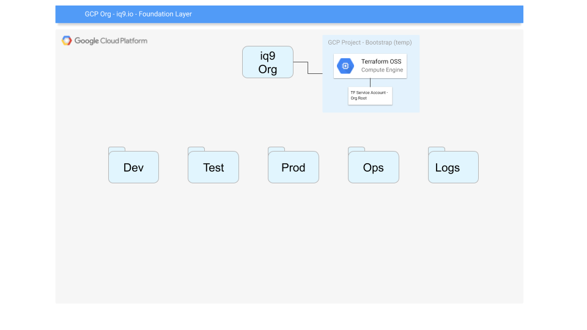

# SMC Infrastructure State Bootstrapping

GCP must be prepared for the infrastructure state to be ensure by Terraform.  This bootstrapping process will use manually run commands to create a dedicated GCP Project that will host the Terraform server.  This Terraform GCP Project is a long lived home for Terraform.  Because of this long lived status we can can wire up dedicated GCP Service Accounts.

With a newly created Google Cloud, a beachhead must be established to enable the Foundation Layer to be ensured by Terraform.  To accomplish this we will follow this excellent documentation from Google, [Managing GCP Projects with Terraform](https://cloud.google.com/community/tutorials/managing-gcp-projects-with-terraform) with a small change, naming the project "Operations" and adding a GCP Folder to contain the Ops environment.

_This GCP bootstrapping will only be run once, manually, and never used again._

## The goal

Create an "Operations" GCP Project that will host the automation to build Google Cloud along with any internal tooling needed by the infrastructure.  This will be the "Ops environment" hosting all infrastructure needed to manage and maintain the entire GCP Org.  The Ops environment would be on the same level as the dev, test, stage, production environments.

## The Steps

### Bootstrap

### Foundation Layer

### Ops Environment

### Logs Environment

### Development Environment

