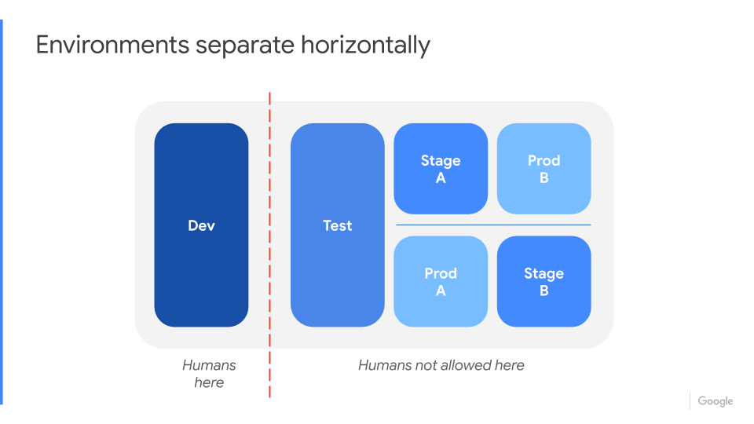
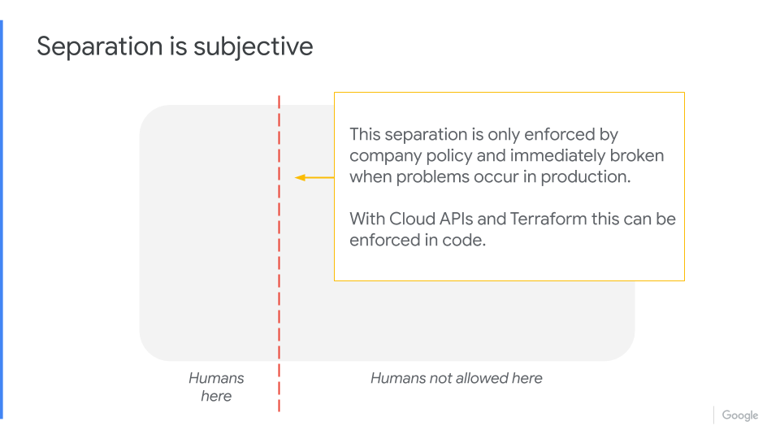
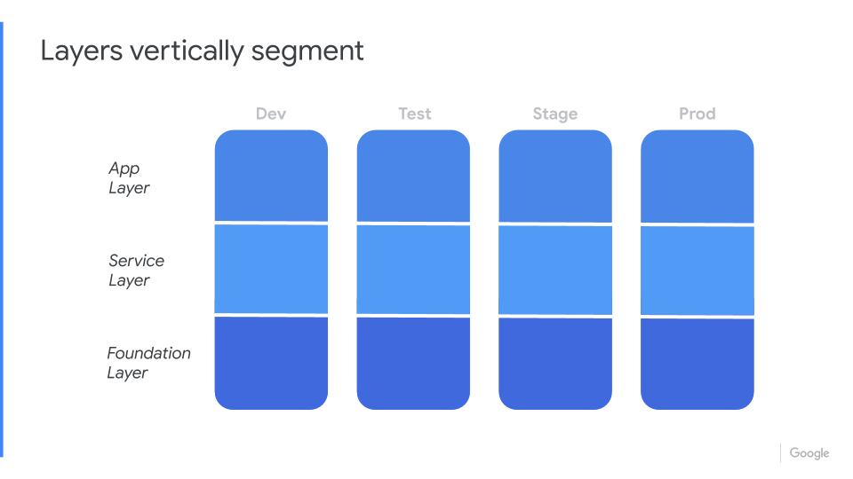

# SMC Infrastructure State

SimplifyMy.Cloud infrastructure state with a focus on simplicity and empathy.

---

## Traditional horizontal environments

A traditional environment segmentation that everyone should be using now is the classic Dev - Test - Prod.

From what we have seen engaging with customers on their infrastructures is humans are everywhere, bringing technical debt, toil, and destruction to everything they type or click.

The main goal for achieving a healthy infrastructure state is to remove the humans from production and keep them in the dev environment where they must have any and all permissions to get their job done.

## Humans in dev - No humans in prod

Using Cloud APIs + Terraform, we can give humans `RO - Read Only` access to production, preventing unknown or unwanted desired state changes to production.  While we are preventing changes to production that are outside of Infrastructure-as-Code, we _must allow engineers to be successful_ by giving them `RW - Read Write`, any and all access needed in the development environment, so they can do their job and go home feeling successful.

## Infrastructure Layers

Breaking apart the cloud into three layers delivers a simple infrastructure state to manage and push changes to.  The goal of a well defined and engineered infrastructure is a DevOps culture which promotes healthy collaboration between all customers of that infrastructure, development, operations, security, end users and management.  Infrastructure empathy is the foundation which this is engineered.  Empathy for developers so they will never worry about making accidental changes to Production, empathy of operations by incorporating self-healing and self-sizing along with self-service for other teams, empathy for the security folks by siloing environments and access into auditable and verifiable worlds.

## Foundation Layer

Definition: The Foundation Layer is responsible for networking, security, users.

## Service Layer

Definition: The Service Layer is responsible for cloud native services (*-as-a-service), Baked VMs, storage, and observability.

## App Layer

Definition: The App Layer is the orchestration of applications, services, data and monitoring that resides into the Services Layer.
