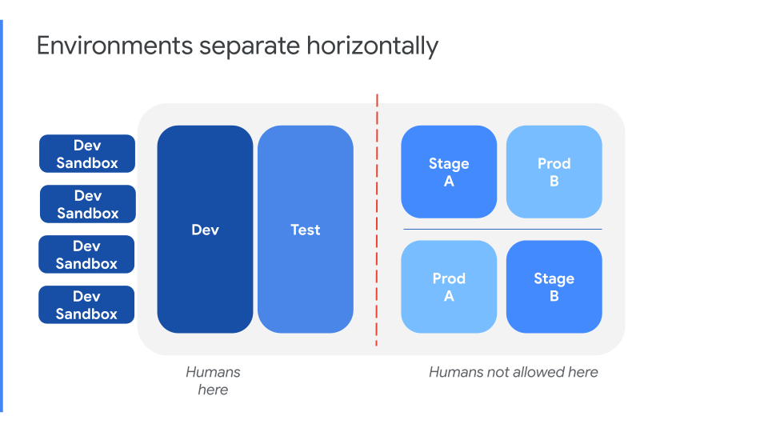
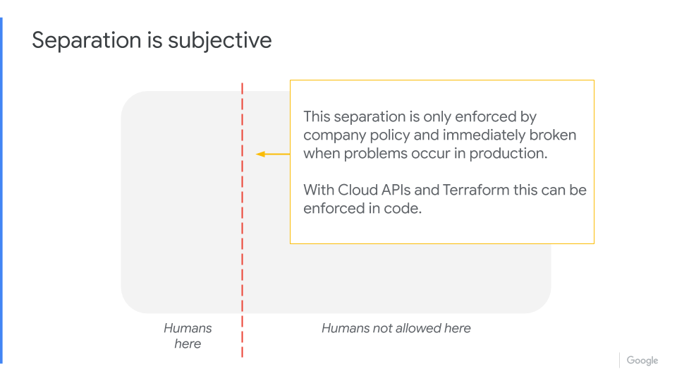
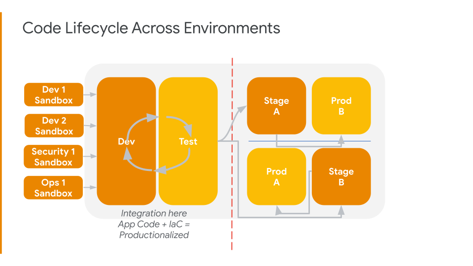
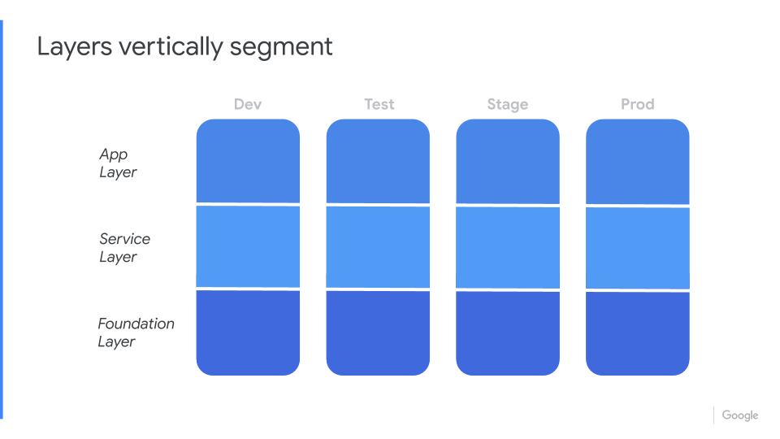

# SMC Infrastructure State

SimplifyMy.Cloud infrastructure state with a focus on simplicity and empathy.

Built using the [GCP Provider Terraform Modules](https://registry.terraform.io/providers/hashicorp/google/latest/docs)

---

## Traditional horizontal environments

A traditional environment segmentation that everyone should be familiar with by now is the classic Sandbox - NonProd - Prod.

From what we have seen engaging with customers on their infrastructures is humans are everywhere, bringing technical debt, toil, and destruction to everything they type or click.

The main goal for achieving a healthy infrastructure state is to remove the humans from production and keep them in the dev environment where they must have any and all permissions to get their job done.

## Humans in sandbox - No humans in prod

Using Cloud APIs + Terraform, we can give humans `RO - Read Only` access to production, preventing unknown or unwanted desired state changes to production.  While we are preventing changes to production that are outside of Infrastructure-as-Code, we _must allow engineers to be successful_ by giving them `RW - Read Write`, any and all access needed in the sandbox and nonprod environment, so they can do their job and go home feeling successful.

## WebUI & CLI welcome in sandbox

Because the Foundation Layer "locks" the base of GCP and prevents unknown or unwanted outside access from the public internet, the developers are freed up to do with their sandbox environments as they please.  We want to empower developers to be mad scientists in a laboratory free to explore solutions to problems or add value to customers.  That means we do not need or want to slow down developers with Terraform code to use their personal sandbox environments.  Devs are free to use the WebUI Console, the GCP API, the CLI, the SDK, whatever empowers them to be creative.  However, at some point, before the code created in the sandbox environment is able to be shipped out and over into the development environment it must be Terraform'd by someone.  

## Environment promotion of code

1. Code genesis in the personal developers sandbox
2. Code promoted to development environment for integration with other app code and Terraform infrastructure state code
3. Code promoted to testing environment for automated security, performance, and infrastructure testing
4. Code promoted to staging environment for 10% migration of production customer traffic along with testing passes by human test team
5. Code fully promoted to production

## Infrastructure Layers

Breaking apart the cloud into three vertical layers delivers a simple infrastructure state to manage and push changes to.  The goal of a well defined and engineered infrastructure is a DevOps culture which promotes healthy collaboration between all customers of that infrastructure, development, operations, security, end users and management.  

Infrastructure empathy is the foundation which this is engineered.  Empathy for developers so they will never worry about making accidental changes to Production, empathy of operations by incorporating self-healing and self-sizing along with self-service for other teams, empathy for the security folks by siloing environments and access into auditable and verifiable worlds.

## Foundation Layer

The Foundation Layer is responsible for ensuring the state of:

* GCP Organization
* GCP Folders
* GCP Projects
* Security
* Networking
* IAM
* Firewalls to the open internet
* GCE Bakery
* Container Bakery

## Service Layer

The Service Layer is responsible for:

* GCP cloud native services
  * GKE
  * GCS
  * BigQuery
  * CloudSQL
  * Cloud Run
* GCE VMs
  * _must be "baked" in the GCP Bakery to be available on the GCP API_

## App Layer

The App Layer is the orchestration of applications deployed and running on the Service Layer services.  The App Layer _should not be_ managed in Terraform! There are better solutions for managing App state, Ansible, Jenkins, Spinnaker, etc.

App Layer hosts:

* Containers
* Helm Charts
* Binaries
