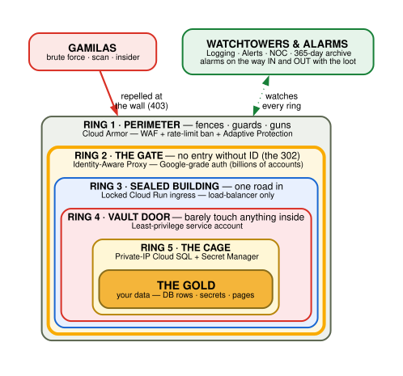

# Security — the Fort Knox Model

> _Put it on the public internet. Then make the internet irrelevant._

This is the security story of the yamato platform: how a wiki that is **fully reachable
from the open internet** is, in practice, a vault. The short version is a single status
code — the IAP `302` that bounces every unauthenticated request to Google's login before a
byte reaches the app — but the real strength is **defense in depth**: a stack of
independent layers where every one has to fail for an attacker to win, and none of them do.

We prove it by attacking ourselves. The [gamilas-redteam](../../foundation/gce-bakery/gamilas-redteam/)
toolkit plays the Gamilas Empire and throws a full red-team arsenal at the Yamato; GCP
stops, logs, and alerts on every move, visible live on the [NOC](#the-noc).

> **Pitch principle:** lead every security topic with the **[Fort Knox analogy](./fort-knox.md)**.
> Business owners buy *"nobody walks out with my gold"*, not "least-privilege IAM." The
> diagram above is the one-slide version.

## The one claim, made un-hecklable

A security talk lives or dies on whether a sharp listener can poke a hole in the claim.
So we make the precise one:

> **You cannot _break_ IAP** — its authentication is Google's own, the same machine that
> guards billions of Gmail/Workspace accounts and Google's internal corp (BeyondCorp). The
> only way _past_ it is to **steal a valid key** (phish a real session). **And we built the
> whole second act to prove that even a stolen key is worthless.**

That splits cleanly into the two acts of the demo:

| Act | Attacker | Result | Proves |
| --- | --- | --- | --- |
| **1** | Unauthenticated / external (no creds) | `302` → Google login, every time | *Nobody penetrates IAP.* |
| **2** | Holds **stolen** valid credentials | Reaches the app as a real identity… and still gets **nothing** | *A stolen key is worthless.* |

Act 1 is IAP doing its job. Act 2 is everything _behind_ IAP doing theirs — least-privilege
identities, private data paths, org-policy guardrails, and total observability.

## The wiki

| Doc | What it covers |
| --- | --- |
| [fort-knox.md](./fort-knox.md) | **The pitch.** The Fort Knox analogy, the diagram, the Fort Knox → GCP → business-meaning mapping, the "can't leave with the loot" close, and a 60-second script. Start here for any presentation. |
| [zero-trust-iap.md](./zero-trust-iap.md) | The identity-as-perimeter model: BeyondCorp, the `302`, why "public internet + IAP" is safe, and the locked-ingress + MFA details that make it airtight. |
| [defense-in-depth.md](./defense-in-depth.md) | Every layer of the stack — Cloud Armor → IAP → locked ingress → least-privilege SAs → private Cloud SQL → Secret Manager → org policies → logging/alerting → org log sink — mapped to exactly where it lives in this repo and what it stops. |
| [red-team-playbook.md](./red-team-playbook.md) | The two-act Gamilas demo: how to run Profile 1 (unauth) and Profile 2 (stolen creds), with the attack → wall → signal mapping for each shot. |

## The formula

The whole platform reduces to one line, and every word is load-bearing:

> **public internet + IAP + locked backend ingress + Cloud Armor + least privilege +
> org policy + full logging = the vault.**

Remove any single term and it's a screen door. [defense-in-depth.md](./defense-in-depth.md)
walks each one.

## The NOC

Operations watch it all from **Yamato Defense Command** — an internal page at
`https://yamato-dev.iq9.io/noc`, itself behind IAP (private to `@iq9.io` /
`@simplifymy.cloud`). It launches the live dashboards, Cloud Armor, and pre-filtered logs,
and carries the attack → defense legend. Source: [app/yamato](../../app/yamato/) (the
`/noc` handler) routed via [service/yamato/dev/frontdoor](../../service/yamato/dev/frontdoor/).

## Where the security actually lives (quick map)

| Layer | Repo location |
| --- | --- |
| Cloud Armor (WAF + rate limit) | [service/yamato/.../frontdoor](../../service/yamato/dev/frontdoor/) |
| IAP + URL routing + locked ingress | [frontdoor](../../service/yamato/dev/frontdoor/) + [cloudrun](../../service/yamato/dev/cloudrun/) |
| Least-privilege runtime SA + Secret Manager | [cloudrun](../../service/yamato/dev/cloudrun/) |
| Private-IP Cloud SQL + PSA | [cloudsql](../../service/yamato/dev/cloudsql/) + [networks](../../foundation/networks/yamato/dev/) |
| Logging, metrics, dashboards, alerts | [service/yamato/.../logging](../../service/yamato/dev/logging/) |
| Org-wide cold-archive audit sink | [foundation/logging](../../foundation/logging/) |
| Org policies (keys, OS Login, external IP) | enforced org-wide; see [gcp_provider.tf](../../gcp_provider.tf) auth notes |
| The red-team attacker | [foundation/gce-bakery/gamilas-redteam](../../foundation/gce-bakery/gamilas-redteam/) |
