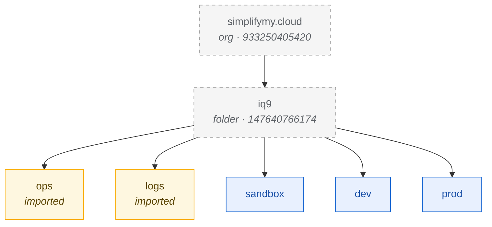

# Foundation Layer — GCP Folders

The five environment folders that anchor the entire `iq9` infrastructure tree. Every project, network, IAM binding, and log line in this repo eventually hangs off one of these folders.

For the broader design philosophy behind this state — hardcoded values, state granularity, and change-control posture — see [`docs/infrastructurestate.md`](../../docs/infrastructurestate.md).

## What this state owns

Five resources, all of type `google_folder`, all parented to the bootstrap-created `iq9` top-level folder (folder ID `147640766174`, under organization `933250405420` — `simplifymy.cloud`). The `iq9` folder itself is *not* managed by this state; it was created by hand during the bootstrap and is treated as a constant. This state owns only its children.

Two of the five folders pre-existed this Terraform state: `ops` and `logs` were created during the bootstrap so that the bootstrap's own audit trail could be captured by the folder-level log sink before the foundation layer ever ran. Those two are brought under management with `terraform import`. The other three — `sandbox`, `dev`, `prod` — are net-new resources created by the first `terraform apply`.

## Folder structure



**Legend:** blue = managed by this state, created on first `apply` · yellow = managed by this state, imported from bootstrap · gray dashed = not managed by this state (created during bootstrap, treated as a constant). When a folder is added, removed, or re-parented, this diagram is updated in the same PR as the `gcp_folders.tf` change so the visual and the code never drift.

## Environment roles

**`ops` — the SRE domain.** Home to everything the platform team owns and operates: the IaC tooling itself (`iq9-ops-iac`, where the foundation Terraform runner and the state bucket live), observability (metrics, dashboards, alerting, oncall, SLOs), and the GCE image bakery. The short-lived `iq9-bootstrap` project also lives here until the rest of the ops environment is fully deployed, at which point it's archived. `ops` is *not* an application environment — no product code or product data ever lands here.

**`logs` — the log warehouse.** Cold, archival log storage with multi-year retention, deliberately separated from the live observability stack in `ops`. Every log line generated anywhere inside `iq9/` flows here through a single folder-scoped log sink with `--include-children`. Designed for compliance, audit, and forensic investigation — not for day-to-day SRE work. The bucket is retention-locked at the policy level so that no project owner, and not even an org admin, can shorten the window or delete logs before they age out. Like `ops`, this is not an application environment.

**`sandbox` — per-engineer playgrounds.** Where engineers stand up GCP resources to learn the platform, test new features, work on certifications, and kick the tires on services they haven't used before. One project per engineer (e.g. `iq9-gcp-sandbox-chris`), IAM-scoped so each engineer is owner of only their own project. Strict policy: **no company code, no company data, no production credentials**. Sandbox projects have lighter org policies and looser quotas precisely because nothing of value lives there.

**`dev` — where code is born.** The application development environment, hosting the application layer, the service layer, and the development-tier GCP services that back them. Inside `dev` there is a sub-environment called `test`, modeled as a separate project (`iq9-gcp-{app}-test`) accessible only to CI/CD service accounts — no humans. `test` is where freshly-merged code blocks integrate against each other for the first time, and where automated test suites run end-to-end before promotion. Lifecycle-coupled to `dev`, but IAM-isolated so a developer can't reach in and accidentally fix a failing CI run.

**`prod` — production.** The customer-facing environment. Inside `prod` is a sub-environment called `stage`, modeled as a separate project (`iq9-gcp-{app}-stage`) that runs the same code as `prod` but receives no live customer traffic. `stage` is the blue side of a blue/green flip-flop: deployments target `stage`, smoke tests run, traffic shifts incrementally, and on the next release `stage` and `prod` swap roles. Both share the same folder for IAM and policy inheritance reasons; they're distinguished by traffic split, not by environment boundary.

A note on `test` and `stage`: they're sub-environments — conceptually distinct, lifecycle-coupled to their parent. They appear in the repo as projects inside the parent folder, distinguished by IAM (test: CI-only) and traffic split (stage: no live traffic). They are *not* their own folders. If they were, every PR that touched `dev` would have to consider whether it also applies to `dev/test`, doubling the cognitive load for no isolation gain.

## Files in this directory

| File | Purpose |
| --- | --- |
| `gcp_folders.tf` | All 5 folder resources, hardcoded |
| `gcp_folders_gcs_backend.tf` | TF state lives at `gs://iq9-iac-ops-tf-state-bucket/terraform/state/foundation/gcp-folders/` |
| `gcp_provider.tf` | Soft link to repo-root `gcp_provider.tf` (terraform / provider version pins, no inline config) |
| `readme.md` | This file |

## First-time setup

The two bootstrap-created folders must be imported into Terraform state before the first `apply`. GCP enforces uniqueness on a folder's `display_name` within its parent; without import, Terraform would try to create a second `ops` and a second `logs`, and the API would reject both.

```bash
cd foundation/gcp-folders/

terraform init

terraform import google_folder.ops  folders/340182878863
terraform import google_folder.logs folders/473370836814

terraform plan   # should show ops + logs as no-op, sandbox + dev + prod as create
terraform apply  # creates the three new folders
```

## Subsequent runs

```bash
cd foundation/gcp-folders/
terraform init
terraform plan   # steady state — should report "No changes."
```

If a `plan` ever shows drift on this state, something has changed by hand and the audit log is the next stop.
