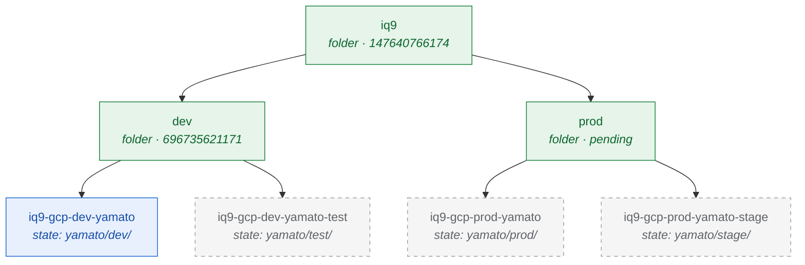

# Foundation Layer — yamato Projects

The GCP projects that host the `yamato` application across its environments. `yamato` is the Star Blazers ships/characters/planets codex — a small Go web app reading from a Cloud SQL Postgres database, served from Cloud Run.

For the broader design philosophy — hardcoded values, state granularity, and change-control posture — see [`docs/infrastructurestate.md`](../../../docs/infrastructurestate.md).

## Layout

One Terraform state per project. Each environment subdirectory below is its own independent state file with its own backend prefix, so a change to `dev` never touches `prod` planning, and a future second app starts as a sibling tree without ever crossing yamato state.



**Legend:** green = GCP folder · blue = project managed by this state and currently provisioned · gray dashed = planned but not yet provisioned. `test` and `stage` are sub-environments by folder hierarchy (test parents to `dev`, stage parents to `prod`) but live as peer state directories so each gets its own blast radius.

## Environment status

| Subdir | Project | Folder | Status |
| --- | --- | --- | --- |
| [`dev/`](./dev/) | `iq9-gcp-dev-yamato` | `dev` (`696735621171`) | provisioned |
| `test/` | `iq9-gcp-dev-yamato-test` | `dev` (`696735621171`) | pending — added when CI/CD wiring lands |
| `stage/` | `iq9-gcp-prod-yamato-stage` | `prod` (TBD) | pending — added when prod is activated |
| [`prod/`](./prod/) | `iq9-gcp-prod-yamato` | `prod` (TBD) | pending — placeholder readme only |

## Activation pattern

Every environment subdir follows the same shape:

```
yamato/{env}/
├── gcp_projects_yamato_{env}.tf            (one google_project resource, hardcoded)
├── gcp_projects_yamato_{env}_gcs_backend.tf (state prefix: foundation/gcp-projects/yamato/{env}/)
├── gcp_provider.tf                          (symlink to repo-root)
└── readme.md
```

`auto_create_network = false` and `deletion_policy = "PREVENT"` are constant across environments. Labels are always `env={env}` and `app=yamato`. No APIs are enabled here — those belong to the states that actually use them.
